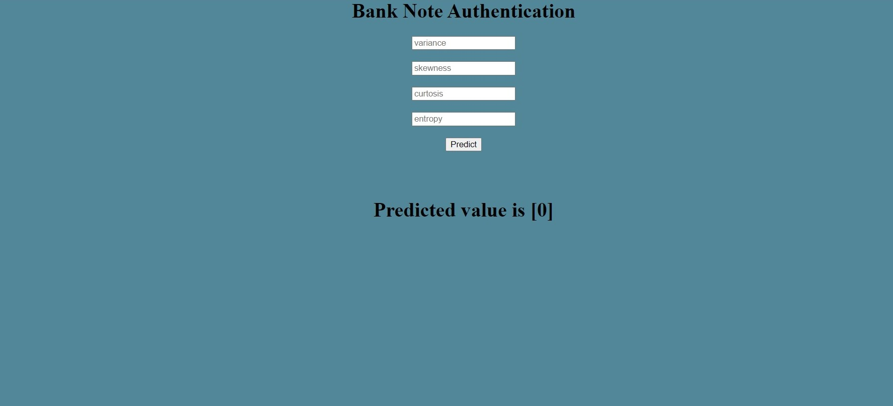

# Bank Note Authentication
This is a end to end Machine Learning Project to authenticate by giving appropriate input. I have deployed it in Heroku with Python Flask backend.I have used docker in this     project

Data were extracted from images that were taken from genuine and forged banknote-like specimens. For digitization, an industrial camera usually used for print inspection was used. The final images have 400x 400 pixels. Due to the object lens and distance to the investigated object gray-scale pictures with a resolution of about 660 dpi were gained. Wavelet Transform tool were used to extract features from images.

 - Bank Note Authentication UCI ML Repository [Dataset](https://www.kaggle.com/ritesaluja/bank-note-authentication-uci-data)
 - [Demo of the project](https://fakecurrency.herokuapp.com/)
 
**Libraries & Tech stacks Used:**

1)Sci-kit Learn

2)Python Flask

3)Pickle

4)Pandas

5)Numpy

6)HTML to make frontend

7)Docker

# Running the project

**1.** Ensure that you are in the project home directory. Create the machine learning model by running below command -
'python model.py'
This would create a serialized version of our model into a file model.pkl

**2.** Run app.py using below command to start Flask API
'python app.py'
By default, flask will run on port 5000.

**3.** Navigate to URL http://localhost:5000
You should be able to view the homepage as below : 

**3.** Enter valid numerical values in all 3 input boxes and hit Predict.

**If everything goes well, you should be able to see the predcited salary vaule on the HTML page!**

